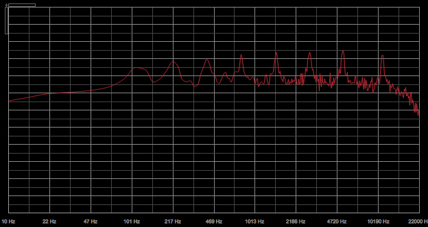

B1;2c# RaspPi-Resonant-EQ
A MIDI controllable DSP version of the [Serge Resonant Equalizer](http://www.cgs.synth.net/modules/cgs202_reseq.html)



## Setup Your Pi

Begin with a clean install of Raspbian. Install these programs to run the instrument:

```
sudo apt-get update
sudo apt-get install csound
sudo apt-get install puredata
```

Clone this repo
`git clone https://github.com/jbeuckm/RaspPi-Resonant-EQ.git res_eq`

Create a startup script...
`pico autostart.sh`

Add these lines to your autostart.sh file:
```
#!/bin/bash
pd -nogui -alsamidi -mididev 1 -noaudio &
csound /home/pi/res_eq/res_eq.csd
```

Save the file, and ake your script executable.
`sudo chmod +x autostart.sh`

Edit your cron tasks:
`sudo crontab -e`

And tell cron to run your script on startup:
`@reboot /bin/bash /home/pi/autostart.sh`

Restart and verify that the program starts...
`sudo reboot`


